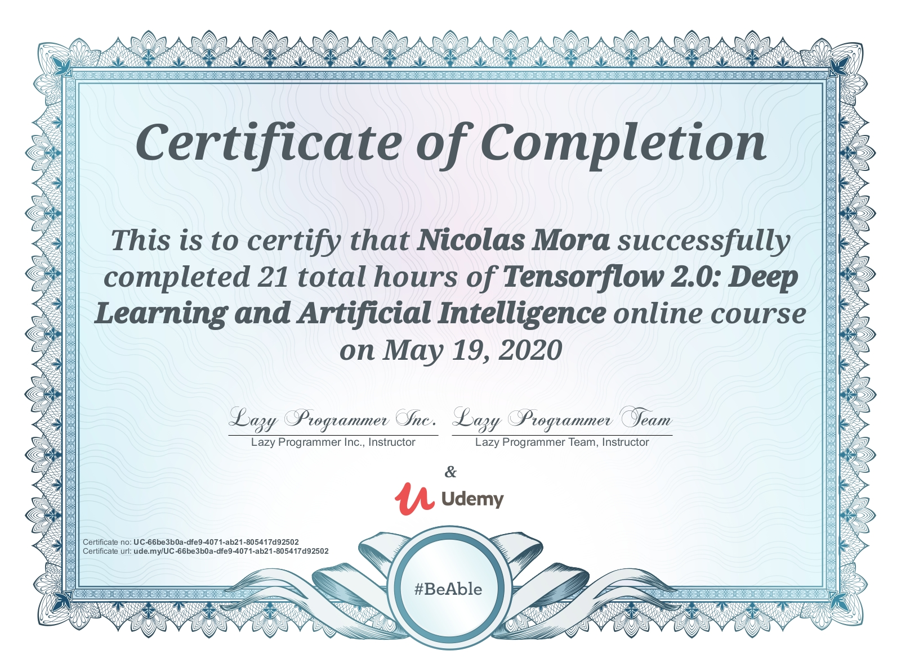

# Tensorflow 2.0: Deep Learning and Artificial Intelligence Projects and Exercise Work

## Table of contents
* [Introduction](#introduction)
* [Technologies](#technologies)
* [Certificate of Completion](#certificate)

## Introduction
This is a repository of my projects and exercise solutions for the Udemy course, [Tensorflow 2.0: Deep Learning and Artificial Intelligence](https://www.udemy.com/course/deep-learning-tensorflow-2/).

This course was created by: Lazy Programmer Inc., Lazy Programmer Team.
The projects and exercises were completed by Jose Nicolas Mora (me).

The repo *.ipynb files contain headers describing the code, followed by the code itself, and plots created. These *.ipynb Python files allow for the code, and plots created by the code, to be visible on Github itself without needing to run the code. This can be done by clicking on the *.ipynb file of an exercise or project on GitHub.

## Technologies
- [Python version: 3.6.9](https://www.python.org)
- [Numpy version: 1.18.4](https://numpy.org)
- [Pandas version: 1.0.3](https://pandas.pydata.org)
- [Matplotlib version: 3.1.1](https://matplotlib.org)
- [Seaborn version: 0.10.1](https://pypi.org/project/seaborn/)
- [Scikit-Learn version: 0.22.2.post1](https://scikit-learn.org/stable/index.html)
- [Tensorflow version: 2.2.0](https://www.tensorflow.org)

## Certificate of Completion

